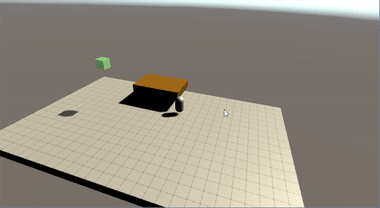
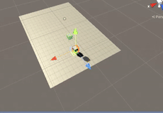

# MachineLearnedCats
Cats and other types of enemies, engineered for minimum boredom.

First cats had a big thirst for death (all were suicides):

They did eventually learn to jump and collect, about 60-70%:

